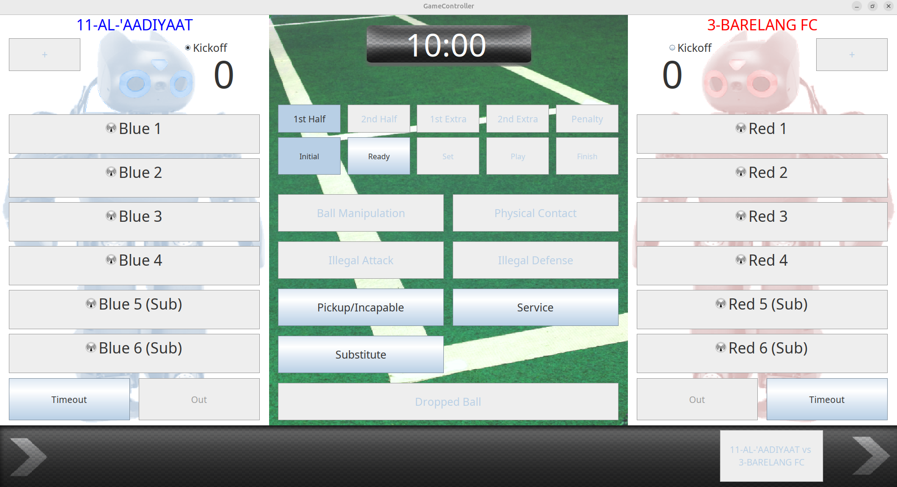
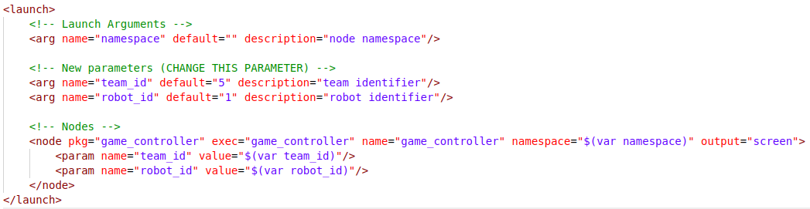

# Game Controller to Track Game State during Matches

The Game Controller is used track the current state of the game during matches.
The server is managed by the referees and our program is just fetching the information from the server.

This is the interface of the game controller server during match:


> [!IMPORTANT]
> Our client program is a UDP socket that communicates on port 3838.
> **We don't need to specify a specific server IP address** because the program will **automatically discover** for any UDP socket on the **local network at port 3838** using `Boost` library.

The only configuration we need to change is the `robot_id` and `player_id`, both is an integer number

- `robot_id`: Given in every match to differantiate between team, e.g. red team is 1 and blue team is 2.
- `player_id`: Our robot designated id. For example we have three robot then we can give 1, 2, 3 id number to each robot whatever we want.

This configuration is located in the `game_controller.launch.xml` launch file inside `game_controller` package in altair_misc folder.



The information we get from game controller is published trought topic `/altair/game_state`

## Run our game controller client

After configuring `robot_id` and `player_id`, **we can run game controller on each robot:**

```bash
ros2 launch game_controller game_controller.launch.xml
```