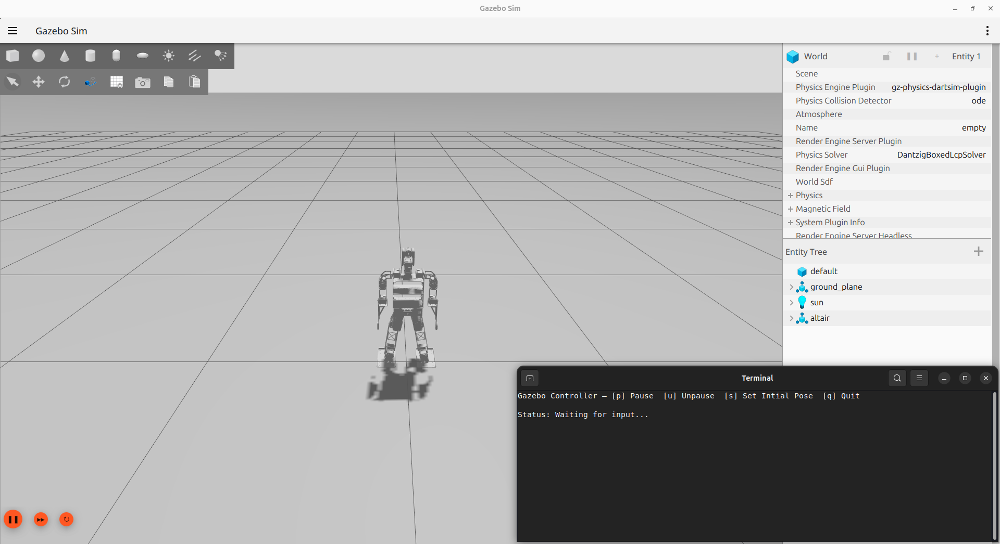

# Altair Simulation in Gazebo

This guide covers how to set up and run the Altair humanoid robot simulation in Gazebo.

## Prerequisites

Before running the simulation, ensure you have completed the installation process from the [altair_ws repository](https://github.com/Altair-Humanoid-GMRT/altair_ws). Follow the README installation instructions carefully.

## Running the Simulation

The simulation requires three separate terminal sessions to run different components simultaneously.

### Terminal 1: Configuration Setup

First, configure the simulation environment:

```bash
./configure.py --sim
```

This command sets up the necessary configuration for simulation mode.

### Terminal 2: MoveIt Motion Planning

In a second terminal, launch the MoveIt motion planning framework:

```bash
ros2 launch altair_moveit_config move_group.launch.py
```

This starts the MoveIt move_group node which handles motion planning and execution.

### Terminal 3: Gazebo Simulation

In a third terminal, launch the Gazebo simulation with the Altair robot:

```bash
ros2 launch quintic_walk altair_gazebo.launch.py
```

This command starts Gazebo with the Altair robot model and the quintic walk controller.

### Play with Gazebo



The gazebo window will open with the robot already spawned. We also get another terminal pop up that shows "Gazebo Controller". From this terminal, we can pause, unpause, set initial position, and quit by just pressing the the button provided inside the bracket ([...]).

## Troubleshooting

- Ensure all dependencies are properly installed as per the altair_ws README
- Verify that your ROS 2 environment is properly sourced
- Check that all required packages are built successfully
