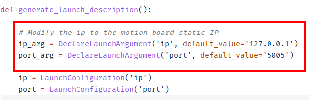
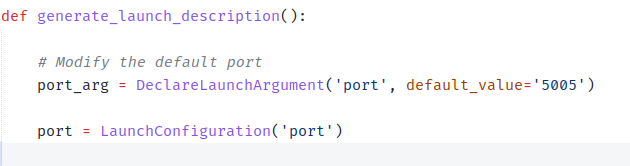

# Vision to Motion Communication Bridge

We have two board of Raspberry Pi 5 that each is used for motion and vision program. To send the data from vision board to motion board, We utilize UDP socket communication to send from vision board to motion board.

## System Explanation


The communication program is located inside `altair_comms` folder at `vision_bridge` package (Path from workspace root: `src/altair_comms/vision_bridge/` ). It is consisted of sender and receiver program. 

### - Sender Program

The sender program is subscribing to topics related to vision data that will be used for fsm or motion program. After subscribing and getting the data, all the data is repacked into 1 big packet structure. The data is not separated into each topic to each packet, but 1 big packet structure for easier serialization. 

After repacked for serialization, the data will get send to the motion board. It use static IP address formerly configured. The port value used in vision boarad and motion board must be the same and not blocked by firewall (disable the firewall). 

### - Receiver Program

The receiver program will directly receive the data as long as the port is the same because we can set the socket to 0.0.0.0, it means to accept all address. The data will be published in 1 big packet. 

> NOTE: `The 1 big packet` is a specific ros2 msg that contains all necessary data. You can modify it inside `altair_msgs` folder at `altair_msgs` package (Path from workspace root: `src/altair_msgs/msg/` )

## Configuration

### - Sender Program



File: `vision_board` package at `src/altair_comms/vision_board/launch/send.launch.py`

Change the value inside quotation mark of the `default value` for `ip` and `port`. The IP address is the target static IP of the motion board. 

> NOTE: The port for both the vision board and motion board must be the same.

### - Receiver Program



File: `vision_board` package at `src/altair_comms/vision_board/launch/receive.launch.py`

Change the value inside the quotation mark of the `default value` for `port`. Note that we don't set any IP in receiver program because the socket can detect communication automatically. 

## How to Use

After we configure the launch file, We can start to send the data to the motion board. To use the system, launch any program related to vision in the vision board like usual.

Then launch the sender program:

```bash
ros2 launch vision_bridge send.launch.py
```

Now go to the motion board, then launch the receive program:

```bash
ros2 launch vision_bridge receive.launch.py
```

## Customization

MAKE SURE TO EDIT THE `SENDER PROGRAM` TO SUBSCRIBE THE RELATED TOPIC THEN REPACT IT TO `THE 1 BIG PACKET` I.E. ONE SPECIFIC ROS2 MSG