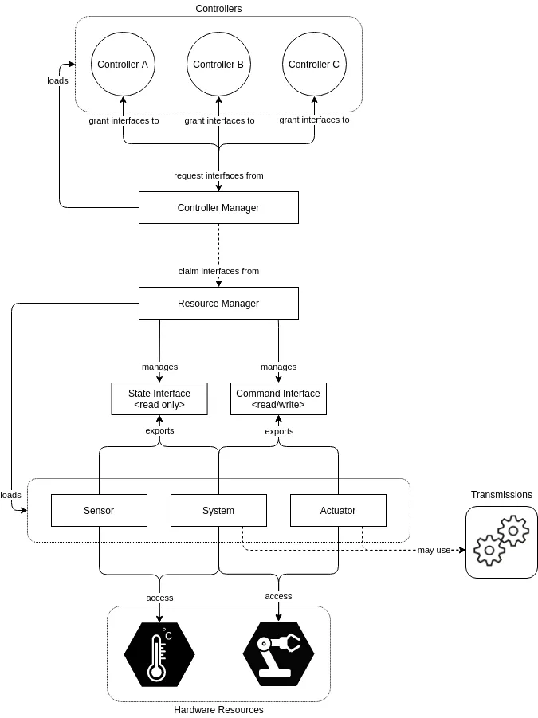

# ros2_control for everyone

**ros2_control** is a framework system developed in ROS 2 ecosystem for elevating production speed and abstraction to any hardware system. The key concept is **abstraction**. From a single framework, you can empowering any robot project to life.

```markdown

```